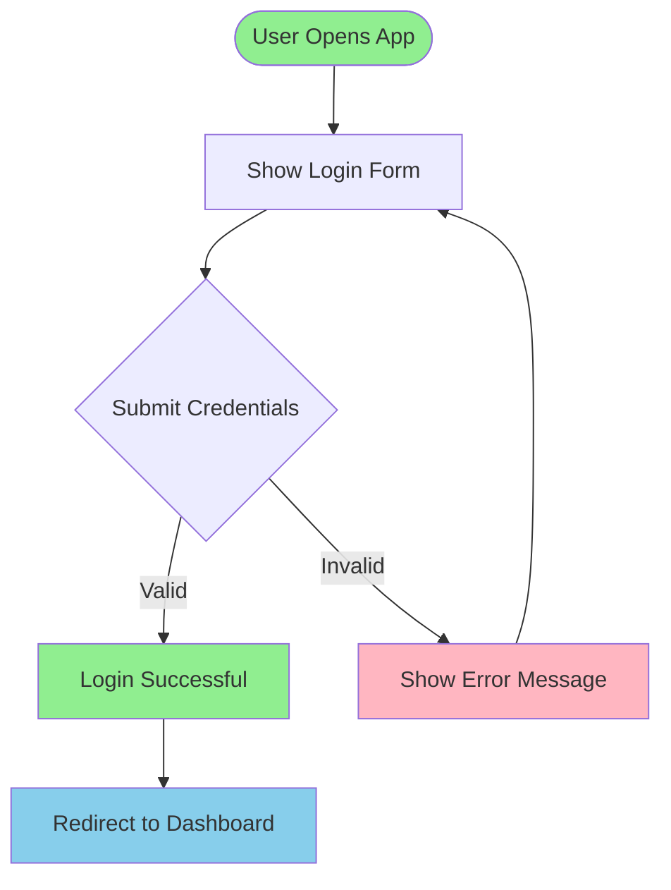
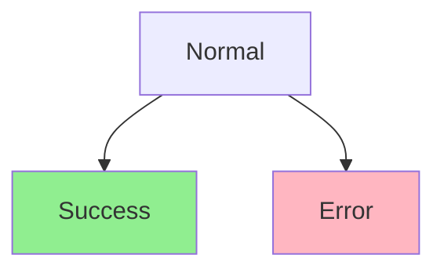
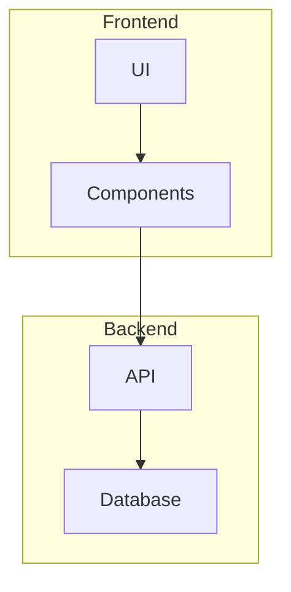
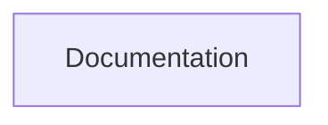
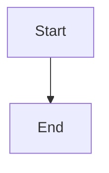

# Mermaid Diagram Creator

## Overview

Mermaid is a text-based diagramming tool that creates visual diagrams from simple text syntax. This skill helps create professional diagrams for documentation, presentations, and technical communication.

Output format: Markdown with mermaid code blocks that can be rendered in GitHub, documentation tools, and modern markdown viewers.

## Quick Start

Basic workflow for creating a diagram:

1. Understand what the user wants to visualize
2. Select the appropriate diagram type
3. Read the relevant reference documentation
4. Generate the mermaid syntax
5. Validate using the validation script
6. Format as markdown output

**Simple flowchart example:**

User request: "Show me a diagram of a login process"



## Diagram Type Selection Guide

Choose the appropriate diagram type based on what needs to be visualized:

### Process and Flow

**Flowchart** - Use for workflows, decision trees, process flows
- Shows steps, decisions, and flow direction
- Best for: algorithms, user flows, business processes
- Reference: `references/flowchart-diagrams.md`

**Mindmap** - Use for brainstorming, concept relationships, hierarchies
- Shows central idea with branching concepts
- Best for: project planning, idea organization
- Reference: `references/flowchart-diagrams.md`

### Interactions and Time

**Sequence Diagram** - Use for interactions between systems/components over time
- Shows message exchanges in chronological order
- Best for: API calls, communication protocols, system interactions
- Reference: `references/sequence-diagrams.md`

**User Journey** - Use for user experience mapping
- Shows user interactions and emotional states over time
- Best for: UX design, customer experience mapping
- Reference: `references/sequence-diagrams.md`

### Structure and Relationships

**Class Diagram** - Use for object-oriented design, data structures
- Shows classes, properties, methods, relationships
- Best for: software architecture, database modeling
- Reference: `references/structure-diagrams.md`

**Entity Relationship (ER) Diagram** - Use for database schemas
- Shows entities, attributes, and relationships
- Best for: database design, data modeling
- Reference: `references/structure-diagrams.md`

**State Diagram** - Use for state machines and transitions
- Shows states and events that trigger transitions
- Best for: system behavior, workflow states
- Reference: `references/structure-diagrams.md`

### Timeline and Planning

**Gantt Chart** - Use for project timelines and schedules
- Shows tasks, durations, dependencies
- Best for: project management, scheduling
- Reference: `references/timeline-diagrams.md`

**Timeline** - Use for chronological events
- Shows events along a time axis
- Best for: history, roadmaps, milestones
- Reference: `references/timeline-diagrams.md`

**Git Graph** - Use for version control branching
- Shows branches, commits, merges
- Best for: git workflow documentation
- Reference: `references/timeline-diagrams.md`

### Data Visualization

**Pie Chart** - Use for showing proportions
- Shows percentage breakdown of a whole
- Best for: market share, resource allocation
- Reference: `references/data-diagrams.md`

**Quadrant Chart** - Use for 2x2 matrix analysis
- Shows items plotted on two axes
- Best for: priority matrices, decision frameworks
- Reference: `references/data-diagrams.md`

## Core Workflow

### Step 1: Analyze User Requirements

Understand what the user wants to visualize:

- **Identify the subject**: What is being diagrammed? (process, system, data, timeline)
- **Determine relationships**: How do elements connect? (sequential, hierarchical, networked)
- **Consider complexity**: Simple (< 10 elements) or complex (> 10 elements)?
- **Check for constraints**: Any specific styling, colors, or layout requirements?

### Step 2: Select Diagram Type

Use the Diagram Type Selection Guide above to choose the most appropriate diagram type.

**Decision heuristics:**
- Temporal/sequential relationships? → Sequence, Gantt, Timeline
- Hierarchical structure? → Flowchart, Class, Mindmap
- Network/graph relationships? → Flowchart, State, ER
- Data proportions? → Pie, Quadrant

### Step 3: Generate Mermaid Syntax

Read the relevant reference file for detailed syntax:

- **Flowchart/Mindmap**: Read `references/flowchart-diagrams.md`
- **Sequence/Journey**: Read `references/sequence-diagrams.md`
- **Class/ER/State**: Read `references/structure-diagrams.md`
- **Gantt/Timeline/Git**: Read `references/timeline-diagrams.md`
- **Pie/Quadrant**: Read `references/data-diagrams.md`

For common syntax patterns and styling tips, reference `references/syntax-quick-reference.md`.

Consider starting from a template in `assets/` directory for common diagram types.

### Step 4: Validate Syntax

Use the validation script to check for syntax errors:

```bash
scripts/validate_mermaid.py diagram.mmd
```

Or with stdin:

```bash
echo "graph TD; A-->B" | scripts/validate_mermaid.py --stdin
```

The script returns JSON with validation results:
- `valid`: boolean indicating if syntax is correct
- `errors`: list of error messages if invalid
- `diagram_type`: detected diagram type

**If validation fails:**
1. Review error messages
2. Check syntax against reference documentation
3. Look for common issues (see Validation Process section)
4. Fix and re-validate

### Step 5: Format Output

Use the standard output template (see Output Format section):
- Diagram title
- Brief description
- Mermaid code block
- Explanation of key elements

## Validation Process

### Using the Validation Script

The `validate_mermaid.py` script validates syntax using the official mermaid-cli tool.

**Requirements:**
- Node.js/npx installed (script uses `npx` to run mermaid-cli without installation)

**Script behavior:**
- Automatically detects diagram type
- Returns structured JSON output
- Exit codes: 0 (valid), 1 (invalid), 2 (tool unavailable)
- 10-second timeout for complex diagrams

**If mermaid-cli is not available:**
- Script will report the error
- Provide installation instructions to user
- Continue with diagram generation (user can validate separately)

### Common Syntax Errors

**Invalid node IDs:**
- ❌ `My Node` (spaces not allowed in IDs)
- ✅ `MyNode` or `my_node`

**Incorrect relationship syntax:**
- ❌ `A->B` (missing second dash for flowcharts)
- ✅ `A-->B`

**Missing diagram type declaration:**
- ❌ Starting with just `A-->B`
- ✅ Starting with `flowchart TD` or `graph TD`

**Unclosed quotes or brackets:**
- ❌ `A["Unclosed quote]`
- ✅ `A["Properly closed"]`

**Invalid characters in labels:**
- Use quotes for labels with special characters
- Example: `A["Label with (parentheses)"]`

### Fixing Errors

1. Read the error message from validation script
2. Identify the line or element causing the issue
3. Consult the relevant reference file for correct syntax
4. Check `references/syntax-quick-reference.md` for common patterns
5. Fix the syntax and re-validate

## Common Patterns

### Styling and Theming

Apply colors and styles to elements:



**Color options:**
- Hex colors: `#90EE90`, `#FFB6C1`, `#87CEEB`
- Color names: `green`, `red`, `blue`
- RGB: `rgb(144,238,144)`

**Style properties:**
- `fill`: background color
- `stroke`: border color
- `stroke-width`: border thickness
- `color`: text color

### Subgraphs and Organization

Group related elements:



### Links and Tooltips

Add clickable links:



### Direction and Layout

Control diagram orientation:

- `TD` or `TB`: Top to bottom (default)
- `BT`: Bottom to top
- `LR`: Left to right
- `RL`: Right to left

Example: `flowchart LR` creates a left-to-right flowchart

### Comments

Add comments for documentation:



## Output Format

Always use this standard format for diagram output:

```markdown
# [Diagram Title]

[1-2 sentence description of what the diagram shows and its purpose]

` ``mermaid
[diagram code]
` ``

## Explanation

[Brief explanation of key elements, relationships, and flow]
- **[Element 1]**: Description
- **[Element 2]**: Description

## Usage

To render this diagram:
- GitHub: Paste in a .md file or README
- Documentation tools: Most markdown renderers support mermaid
- Online: https://mermaid.live for live editing and export
```

(Note: Remove spaces in the backticks when using)

### Multiple Diagrams

When creating multiple related diagrams:

1. Present each with its own heading
2. Explain how diagrams relate to each other
3. Number diagrams if they show a sequence or progression

### Large or Complex Diagrams

For diagrams with > 15 elements:

1. Consider breaking into multiple smaller diagrams
2. Use subgraphs to organize sections
3. Add comments to explain complex sections
4. Include a legend if using custom styling

## Resources

### scripts/

**`validate_mermaid.py`** - Syntax validation script
- Validates mermaid diagram syntax using official mermaid-cli
- Use before finalizing output to catch errors
- Requires Node.js/npx installed
- Returns structured JSON with validation results

### references/

Detailed syntax documentation for each diagram type family. Read the appropriate file when generating specific diagram types:

**`flowchart-diagrams.md`** - Flowchart and mindmap syntax
- Node shapes (rectangles, circles, diamonds, etc.)
- Edge types and styling
- Subgraphs and organization
- Read when creating flowcharts or mindmaps

**`sequence-diagrams.md`** - Sequence and user journey syntax
- Participants and actors
- Message types and activation
- Loops and conditions
- Read when creating sequence diagrams or user journeys

**`structure-diagrams.md`** - Class, ER, and state diagram syntax
- Class definitions and relationships
- Entity relationships and cardinality
- State transitions and events
- Read when creating structural diagrams

**`timeline-diagrams.md`** - Gantt, timeline, and git graph syntax
- Task scheduling and dependencies
- Timeline events and periods
- Branch and merge visualization
- Read when creating timeline-based diagrams

**`data-diagrams.md`** - Pie and quadrant chart syntax
- Dataset definitions
- Chart styling and labels
- Read when creating data visualizations

**`syntax-quick-reference.md`** - Common patterns and tips
- Styling reference
- Link and tooltip syntax
- Common errors and fixes
- Best practices
- Read for quick syntax lookups or troubleshooting

### assets/

Example templates for common diagram types. Copy and modify these as starting points:

**`flowchart-template.mmd`** - Example flowchart with styling
**`sequence-template.mmd`** - Example sequence diagram
**`class-template.mmd`** - Example class diagram with relationships
**`er-template.mmd`** - Example ER diagram

To use a template:
1. Read the template file
2. Copy the structure
3. Modify for specific use case
4. Validate before finalizing
