# Data Visualization Diagrams: Pie and Quadrant Charts

## Pie Chart Syntax

### Basic Structure

Pie charts start with `pie` and show proportional data:

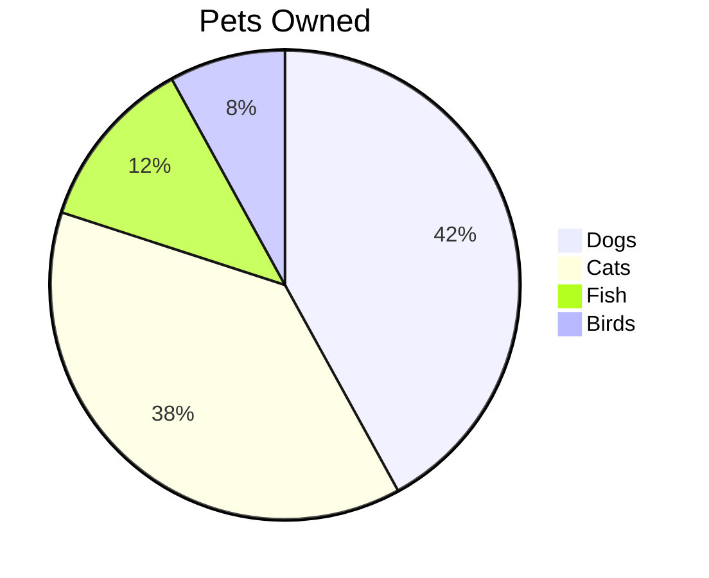

### With Title

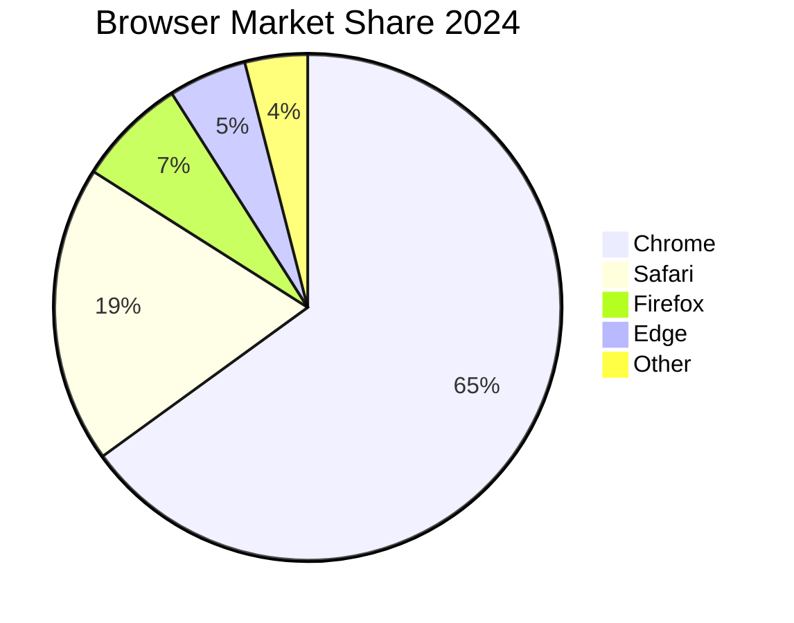

### Without Title

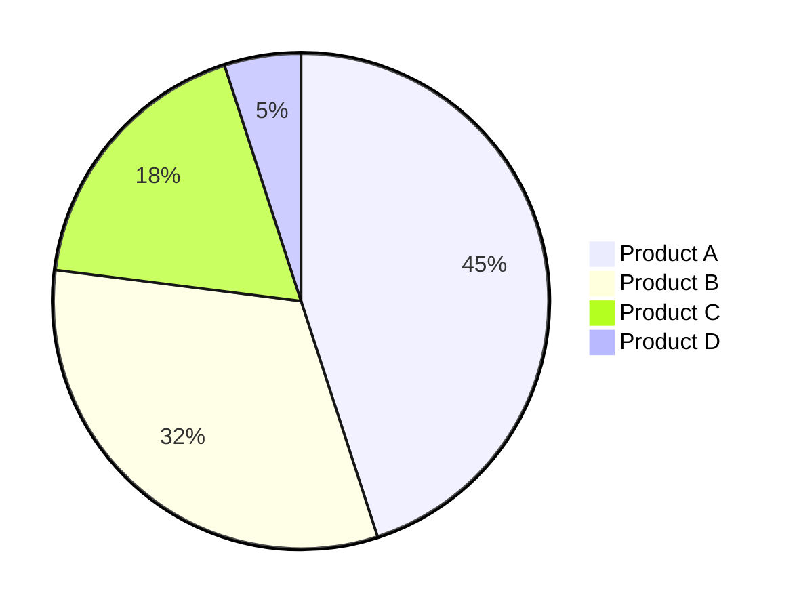

### Data Format

**Syntax:** `"Label" : value`

- Labels must be in quotes
- Values are absolute numbers (converted to percentages automatically)
- No percentage calculations needed

## Quadrant Chart Syntax

### Basic Structure

Quadrant charts show items plotted on two axes:

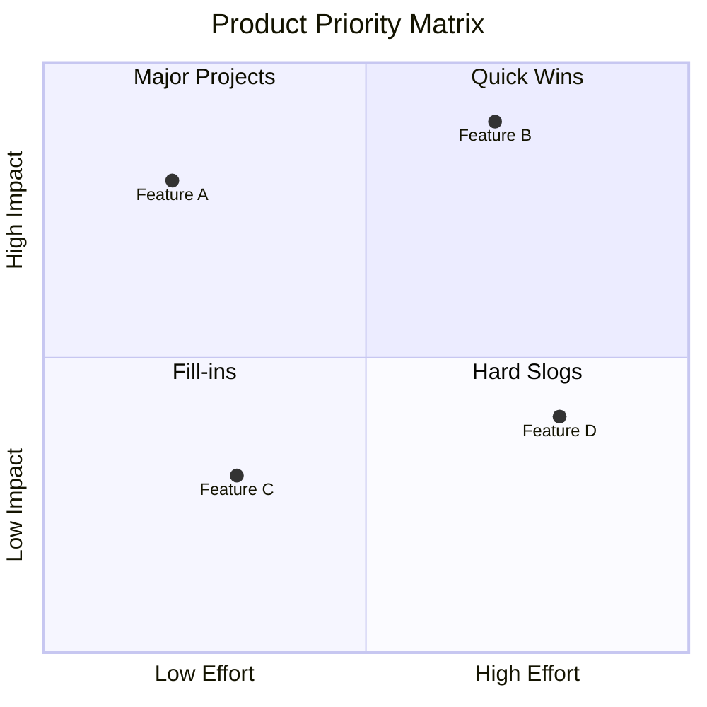

### Axes Definition

**X-axis:** `x-axis Label Left --> Label Right`
**Y-axis:** `y-axis Label Bottom --> Label Top`

### Quadrant Labels

Number quadrants 1-4 (clockwise from top-right):

```
quadrant-1 Top Right
quadrant-2 Top Left
quadrant-3 Bottom Left
quadrant-4 Bottom Right
```

### Data Points

**Syntax:** `Item Name: [x, y]`

- X and Y values range from 0.0 to 1.0
- 0.5 is the midpoint
- Values outside 0-1 will be clamped

## Complete Examples

### Example 1: Team Resource Allocation

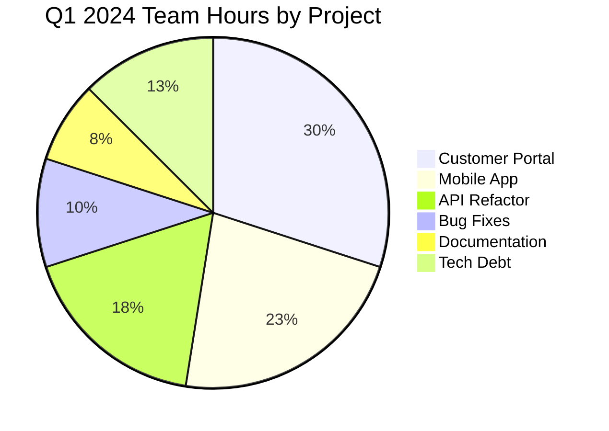

### Example 2: Revenue by Product Line

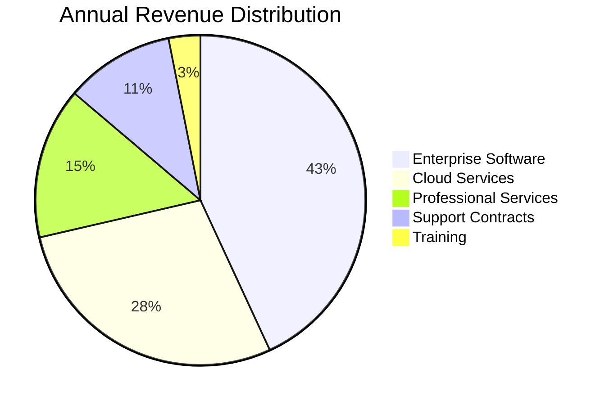

### Example 3: Customer Satisfaction

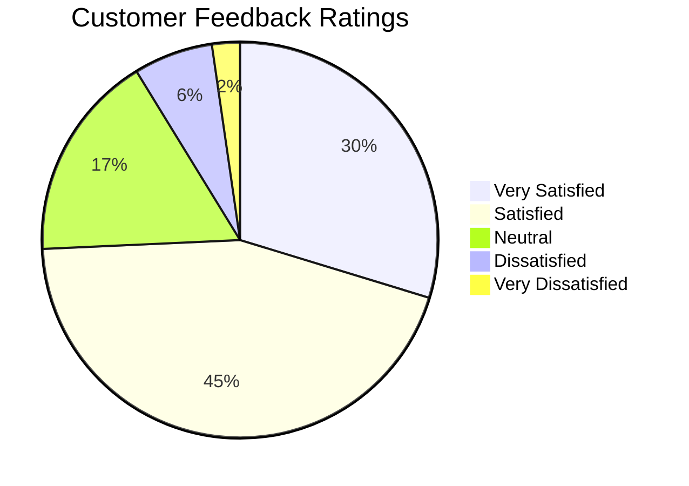

### Example 4: Eisenhower Matrix (Priority Quadrant)

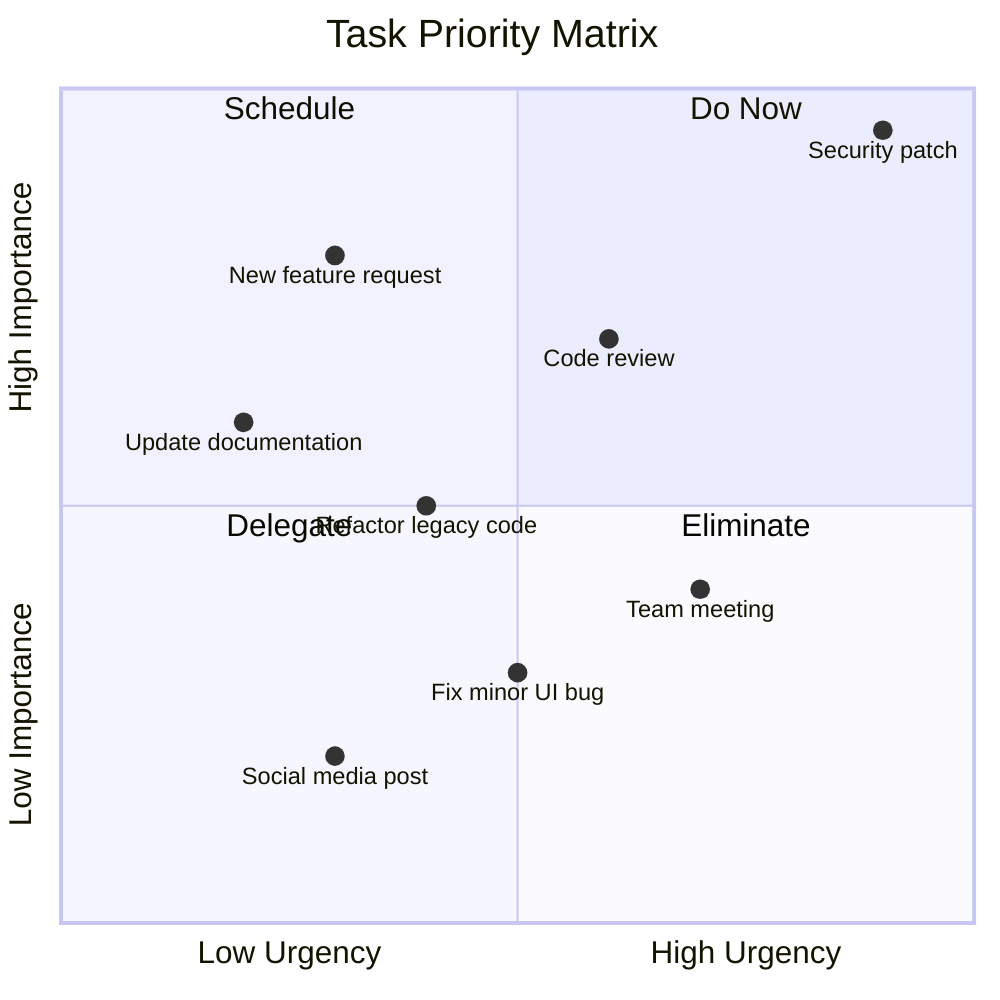

### Example 5: Feature Evaluation Matrix

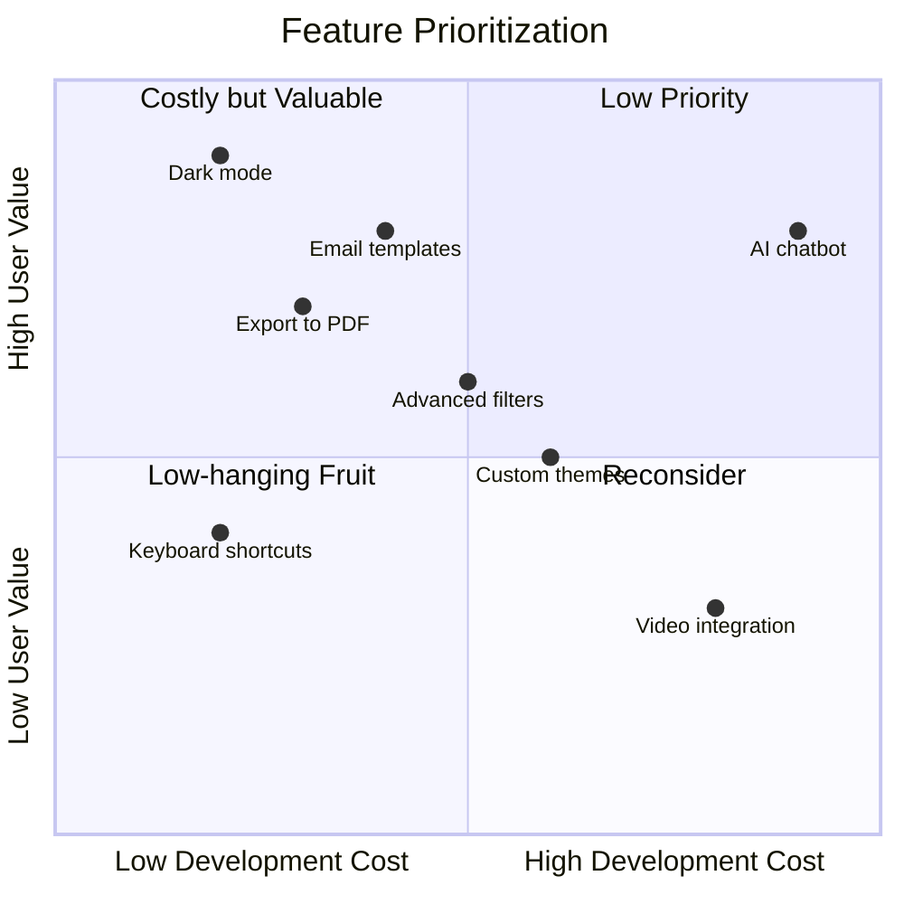

### Example 6: Market Positioning

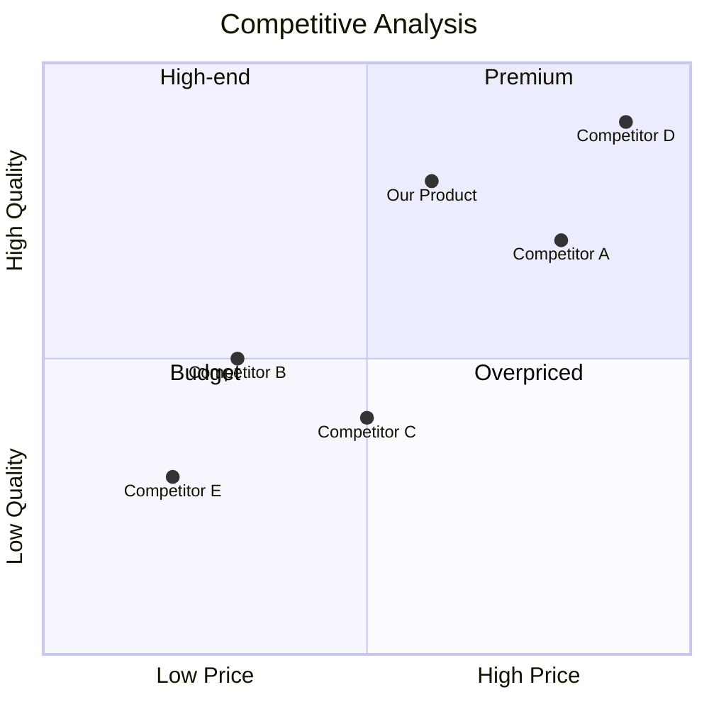

### Example 7: Budget Allocation

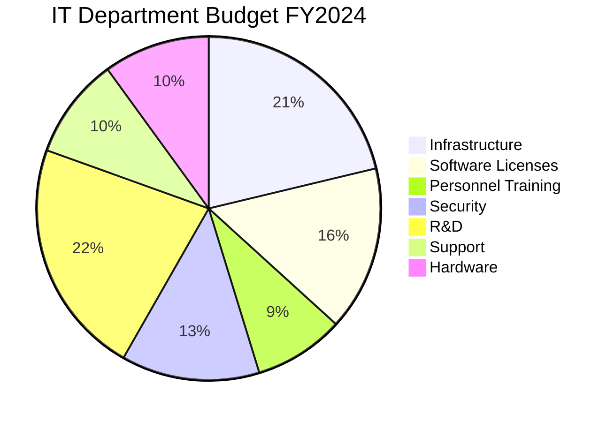

### Example 8: Risk Assessment Matrix

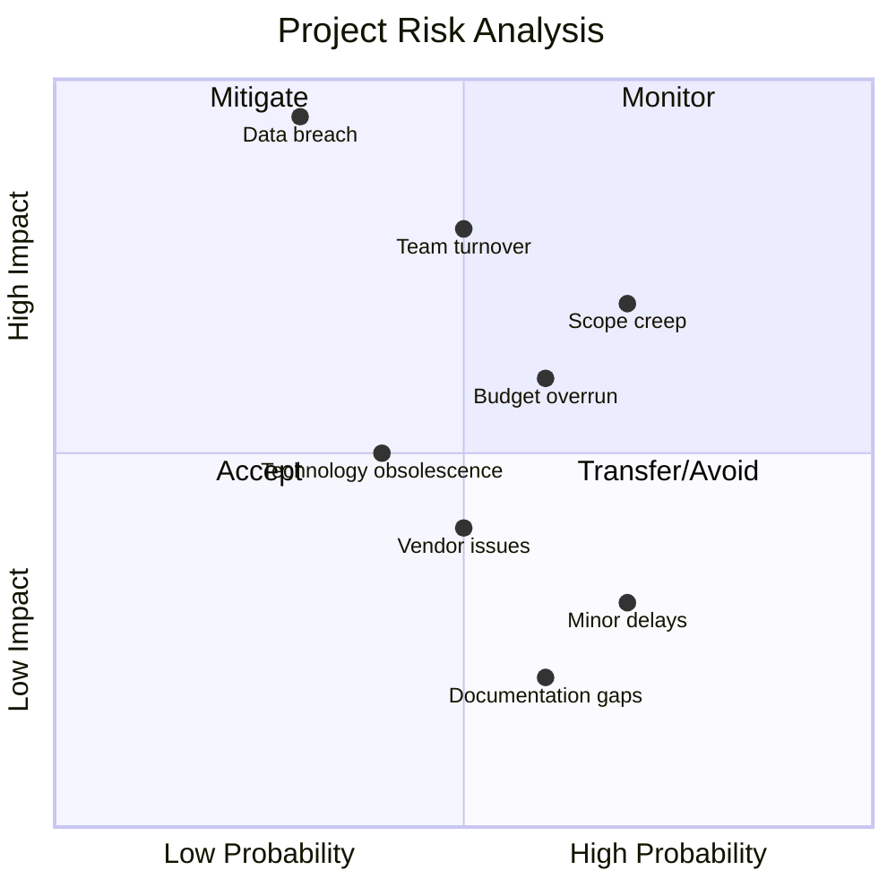

## Tips and Best Practices

### Pie Charts

1. **Limit slices**: Use 5-7 slices maximum for readability
2. **Order by size**: Largest to smallest provides better visual hierarchy
3. **Combine small values**: Group tiny slices into "Other" category
4. **Use descriptive labels**: Make categories clear and concise
5. **Show totals in title**: Include total count or sum if relevant
6. **Avoid 3D**: Stick to 2D pies for accuracy
7. **Consider alternatives**: For many categories, consider bar charts instead

### Quadrant Charts

1. **Choose axes wisely**: Select meaningful dimensions for comparison
2. **Clear quadrant labels**: Use action-oriented labels (Do, Schedule, Delegate)
3. **Meaningful positioning**: Ensure x,y coordinates accurately reflect data
4. **Avoid overcrowding**: 10-15 points maximum
5. **Use consistent scales**: Both axes should use 0.0-1.0 range
6. **Label clearly**: Item names should be concise but descriptive
7. **Context in title**: Include what's being evaluated

### When to Use Each

**Use Pie Charts when:**
- Showing parts of a whole
- Data adds up to 100%
- Comparing proportions
- Limited number of categories
- Exact percentages matter less than relative size

**Use Quadrant Charts when:**
- Comparing items on two dimensions
- Prioritizing tasks or features
- Evaluating trade-offs
- Making strategic decisions
- Showing distribution across categories
- Plotting competitors or options

**Avoid using:**
- Pie charts for time series (use line charts)
- Pie charts with many categories (use bar charts)
- Quadrant charts for simple yes/no decisions (use flowcharts)
- Quadrant charts when only one dimension matters (use bar charts)
