# Flowchart and Mindmap Diagrams

## Flowchart Syntax

### Basic Structure

Flowcharts start with `flowchart` or `graph` followed by direction:

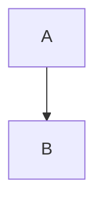

**Direction options:**
- `TD` or `TB`: Top to bottom
- `BT`: Bottom to top
- `LR`: Left to right
- `RL`: Right to left

### Node Shapes

**Rectangle (default):**
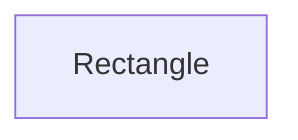

**Rounded rectangle:**
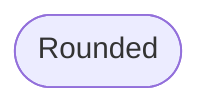

**Stadium (pill shape):**
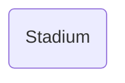

**Circle:**
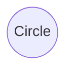

**Diamond (decision):**
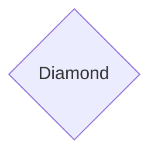

**Hexagon:**
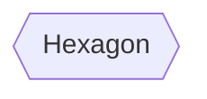

**Parallelogram:**
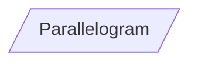

**Trapezoid:**
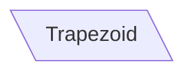

**Double circle:**
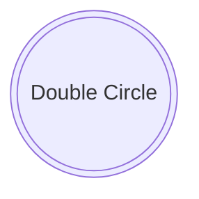

### Edge Types

**Solid arrow:**
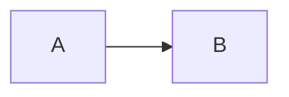

**Open link:**
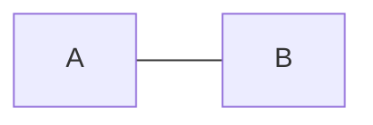

**Text on link:**
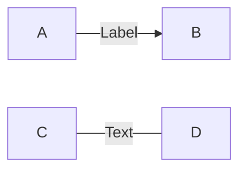

**Dotted link:**
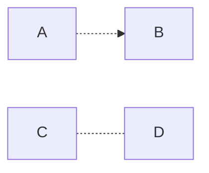

**Thick link:**
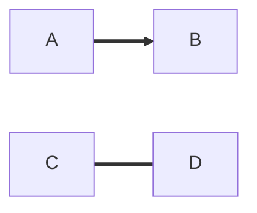

**Multi-directional:**
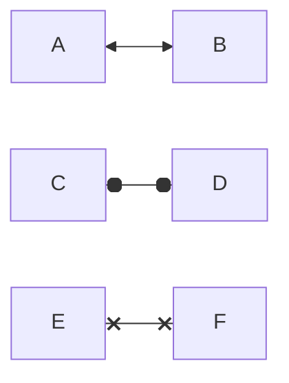

**Chaining:**
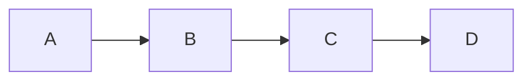

### Subgraphs

Group related nodes:

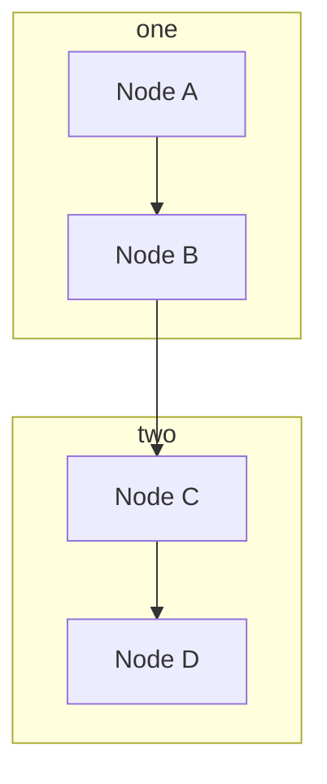

**Subgraph direction:**
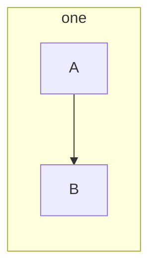

### Styling

**Individual node styling:**
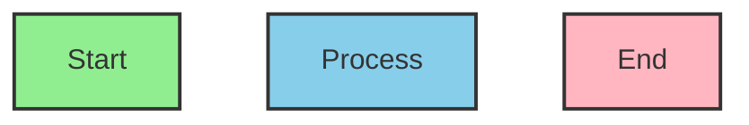

**Class-based styling:**
```mermaid
flowchart TD
    A[Start]:::green
    B[Process]:::blue
    C[End]:::red

    classDef green fill:#90EE90,stroke:#333
    classDef blue fill:#87CEEB,stroke:#333
    classDef red fill:#FFB6C1,stroke:#333
```

### Links and Interactions

**Clickable links:**
```mermaid
flowchart TD
    A[Documentation]
    B[GitHub]

    click A "https://mermaid.js.org"
    click B "https://github.com"
```

**Tooltips:**
```mermaid
flowchart TD
    A[Hover me]
    B[Click me]

    click A "https://example.com" "This is a tooltip"
    click B "https://example.com" "Opens example.com"
```

## Mindmap Syntax

### Basic Structure

Mindmaps start with `mindmap` and use indentation to show hierarchy:

```mermaid
mindmap
  root((Central Idea))
    Branch 1
      Sub-branch 1.1
      Sub-branch 1.2
    Branch 2
      Sub-branch 2.1
```

### Node Shapes in Mindmaps

**Square brackets (default):**
```mermaid
mindmap
  root[Root]
    [Child 1]
    [Child 2]
```

**Rounded:**
```mermaid
mindmap
  root((Root))
    (Child 1)
    (Child 2)
```

**Circle:**
```mermaid
mindmap
  root))Root((
    ))Child 1((
    ))Child 2((
```

**Cloud:**
```mermaid
mindmap
  root)Root(
    )Child 1(
    )Child 2(
```

**Hexagon:**
```mermaid
mindmap
  root{{Root}}
    {{Child 1}}
    {{Child 2}}
```

## Complete Examples

### Example 1: User Registration Flow

```mermaid
flowchart TD
    Start([User Visits Site]) --> CheckAuth{Authenticated?}
    CheckAuth -->|Yes| Dashboard[Show Dashboard]
    CheckAuth -->|No| RegisterForm[Show Registration Form]

    RegisterForm --> Input[User Enters Details]
    Input --> Validate{Valid Input?}

    Validate -->|No| Error[Show Error Message]
    Error --> RegisterForm

    Validate -->|Yes| CreateAccount[Create Account]
    CreateAccount --> SendEmail[Send Verification Email]
    SendEmail --> Success[Show Success Message]
    Success --> Dashboard

    style Start fill:#90EE90
    style Dashboard fill:#87CEEB
    style Error fill:#FFB6C1
    style Success fill:#90EE90
```

### Example 2: CI/CD Pipeline

```mermaid
flowchart LR
    subgraph Development
        Code[Write Code] --> Commit[Commit Changes]
        Commit --> Push[Push to GitHub]
    end

    subgraph CI
        Push --> Build[Build Application]
        Build --> Test[Run Tests]
        Test --> QualityGate{Tests Pass?}
    end

    subgraph CD
        QualityGate -->|Yes| Deploy[Deploy to Staging]
        Deploy --> Integration[Integration Tests]
        Integration --> Approve{Manual Approval?}
        Approve -->|Yes| Production[Deploy to Production]
    end

    QualityGate -->|No| Notify[Notify Team]
    Notify --> Code

    style Build fill:#87CEEB
    style Test fill:#87CEEB
    style Deploy fill:#DDA0DD
    style Production fill:#90EE90
    style Notify fill:#FFB6C1
```

### Example 3: E-commerce Order Processing

```mermaid
flowchart TD
    Start([Customer Places Order]) --> Inventory{Items in Stock?}

    Inventory -->|No| OutOfStock[Notify Out of Stock]
    OutOfStock --> End1([Order Cancelled])

    Inventory -->|Yes| Payment[Process Payment]
    Payment --> PaymentCheck{Payment Success?}

    PaymentCheck -->|No| PaymentFailed[Payment Failed]
    PaymentFailed --> Retry{Retry?}
    Retry -->|Yes| Payment
    Retry -->|No| End2([Order Failed])

    PaymentCheck -->|Yes| FulfillmentCenter[Send to Fulfillment]
    FulfillmentCenter --> Package[Package Items]
    Package --> Ship[Ship Order]
    Ship --> EmailTracking[Email Tracking Info]
    EmailTracking --> Deliver[Deliver to Customer]
    Deliver --> End3([Order Complete])

    style Start fill:#90EE90
    style OutOfStock fill:#FFB6C1
    style PaymentFailed fill:#FFB6C1
    style End1 fill:#FFB6C1
    style End2 fill:#FFB6C1
    style End3 fill:#90EE90
```

### Example 4: Software Development Decision Tree

```mermaid
flowchart TD
    Start{New Feature Request} --> Type{Type of Feature?}

    Type -->|UI Component| Frontend[Frontend Task]
    Type -->|API Endpoint| Backend[Backend Task]
    Type -->|Data Model| Database[Database Task]

    Frontend --> FrameworkCheck{Framework Known?}
    FrameworkCheck -->|Yes| Implement1[Implement Component]
    FrameworkCheck -->|No| Research1[Research Best Practices]
    Research1 --> Implement1

    Backend --> APIDesign[Design API Contract]
    APIDesign --> Implement2[Implement Endpoint]

    Database --> SchemaDesign[Design Schema]
    SchemaDesign --> Migration[Create Migration]
    Migration --> Implement3[Update Models]

    Implement1 --> Test
    Implement2 --> Test
    Implement3 --> Test

    Test[Write Tests] --> Review[Code Review]
    Review --> Approved{Approved?}

    Approved -->|No| Revise[Make Changes]
    Revise --> Review

    Approved -->|Yes| Merge[Merge to Main]
    Merge --> Deploy[Deploy]

    style Start fill:#87CEEB
    style Test fill:#DDA0DD
    style Merge fill:#90EE90
    style Deploy fill:#90EE90
```

### Example 5: Content Moderation System

```mermaid
flowchart LR
    subgraph User Input
        A[User Submits Content]
    end

    subgraph Automated Checks
        A --> B[Text Analysis]
        A --> C[Image Scan]
        A --> D[Link Verification]

        B --> E{Inappropriate Text?}
        C --> F{Inappropriate Image?}
        D --> G{Malicious Links?}
    end

    subgraph Decision
        E -->|Yes| H[Flag for Review]
        F -->|Yes| H
        G -->|Yes| H

        E -->|No| I[Calculate Score]
        F -->|No| I
        G -->|No| I

        I --> J{Score > Threshold?}
    end

    subgraph Action
        J -->|No| K[Publish Content]
        J -->|Yes| H

        H --> L[Human Review Queue]
        L --> M{Moderator Decision}

        M -->|Approve| K
        M -->|Reject| N[Notify User]
    end

    style H fill:#FFB6C1
    style N fill:#FFB6C1
    style K fill:#90EE90
```

### Example 6: Project Planning Mindmap

```mermaid
mindmap
  root((Mobile App Project))
    Planning
      Requirements Gathering
      Timeline Definition
      Budget Allocation
      Risk Assessment
    Design
      User Research
      Wireframes
      UI Design
        Color Scheme
        Typography
        Components
      UX Flow
    Development
      Frontend
        React Native
        State Management
        API Integration
      Backend
        Database Design
        API Development
        Authentication
      Testing
        Unit Tests
        Integration Tests
        E2E Tests
    Launch
      Beta Testing
      App Store Submission
      Marketing Campaign
      User Feedback Collection
```

### Example 7: Machine Learning Workflow

```mermaid
flowchart TD
    A[Define Problem] --> B[Collect Data]
    B --> C{Sufficient Data?}
    C -->|No| B
    C -->|Yes| D[Clean & Preprocess Data]

    D --> E[Exploratory Data Analysis]
    E --> F[Feature Engineering]
    F --> G[Split Data]
    G --> H[Train/Val/Test Sets]

    H --> I[Select Model Architecture]
    I --> J[Train Model]
    J --> K[Evaluate on Val Set]

    K --> L{Performance Good?}
    L -->|No| M{Overfitting?}

    M -->|Yes| N[Add Regularization]
    M -->|No| O[Adjust Hyperparameters]
    M -->|Maybe| P[Get More Data]

    N --> J
    O --> J
    P --> B

    L -->|Yes| Q[Test on Test Set]
    Q --> R{Test Performance Good?}

    R -->|No| S[Revisit Feature Engineering]
    S --> F

    R -->|Yes| T[Deploy Model]
    T --> U[Monitor Performance]
    U --> V{Drift Detected?}
    V -->|Yes| W[Retrain]
    W --> B
    V -->|No| U

    style T fill:#90EE90
    style U fill:#87CEEB
```

## Tips and Best Practices

1. **Keep it simple**: Use flowcharts for < 20 nodes for best readability
2. **Use subgraphs**: Group related nodes to reduce visual complexity
3. **Consistent styling**: Use colors consistently (e.g., green for start/success, red for errors)
4. **Clear labels**: Use descriptive text for nodes and edges
5. **Direction matters**: Choose TD for process flows, LR for timeline-style flows
6. **Avoid crossing lines**: Rearrange nodes to minimize edge crossings
7. **Use shapes semantically**: Diamonds for decisions, rounded for start/end, rectangles for process steps
