# Structure Diagrams: Class, ER, and State

## Class Diagram Syntax

### Basic Structure

Class diagrams start with `classDiagram` and show object-oriented structures:

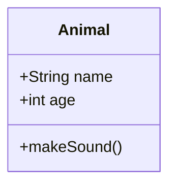

### Class Definition

**Properties and methods:**
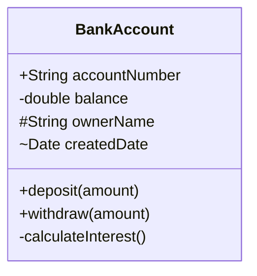

**Visibility modifiers:**
- `+` Public
- `-` Private
- `#` Protected
- `~` Package/Internal

**Property types:**
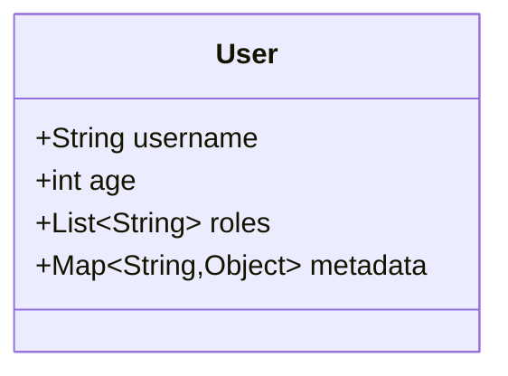

### Relationships

**Inheritance (generalization):**
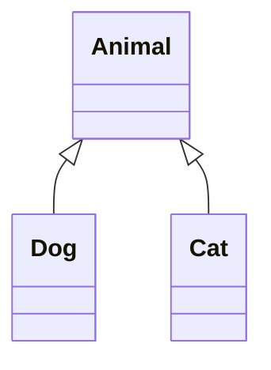

**Composition (strong ownership):**
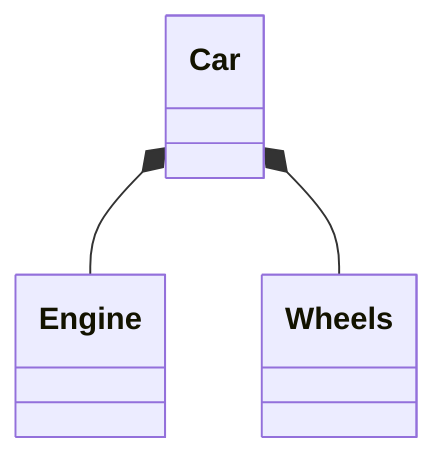

**Aggregation (weak ownership):**
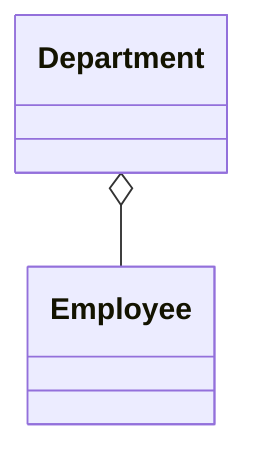

**Association:**
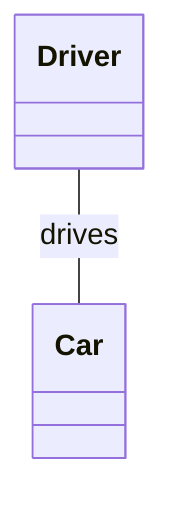

**Dependency:**
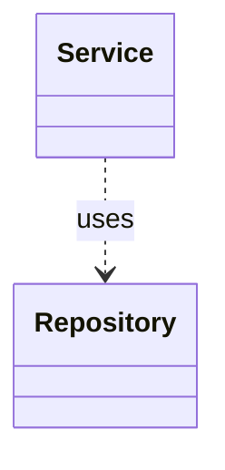

**Realization (interface implementation):**
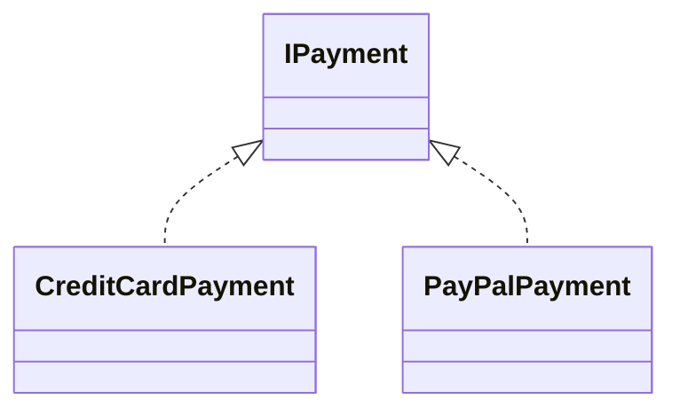

### Cardinality

Specify relationship multiplicity:

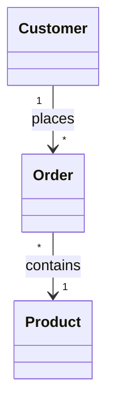

**Cardinality options:**
- `1` : Exactly one
- `*` or `n` : Many
- `0..1` : Zero or one
- `1..*` : One or more
- `m..n` : Between m and n

### Labels and Annotations

**Relationship labels:**
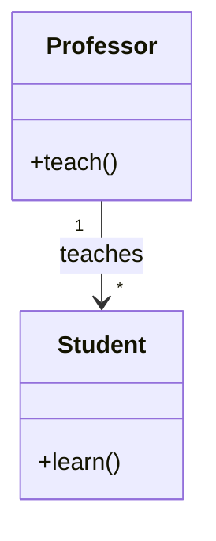

**Abstract classes and interfaces:**
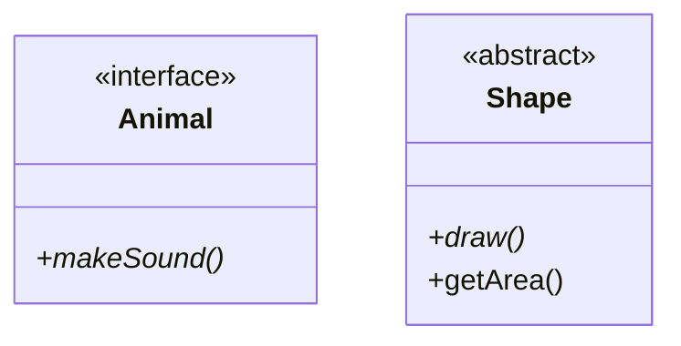

## Entity Relationship (ER) Diagram Syntax

### Basic Structure

ER diagrams start with `erDiagram` and show database schema:

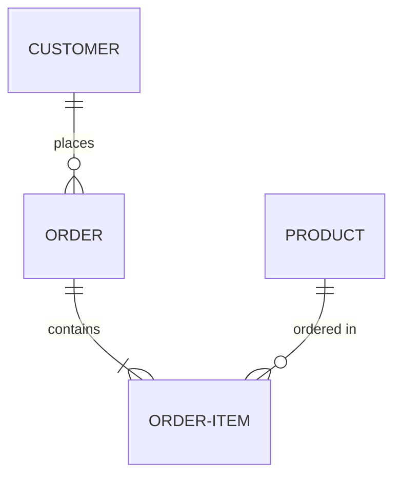

### Entities and Attributes

**Define entities with attributes:**
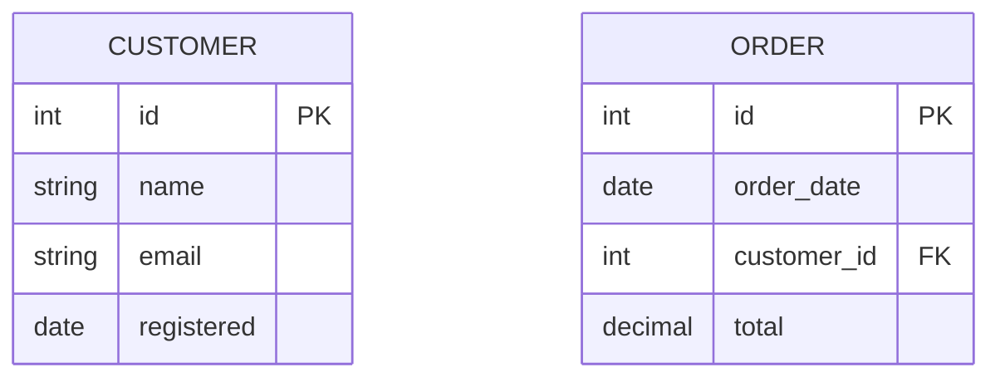

**Attribute key types:**
- `PK` : Primary Key
- `FK` : Foreign Key

### Relationships

**Relationship syntax:** `ENTITY1 <cardinality><relationship><cardinality> ENTITY2 : label`

**Cardinality symbols:**
- `||` : Exactly one
- `|o` : Zero or one
- `}o` : Zero or more
- `}|` : One or more

**Relationship examples:**

**One to one:**
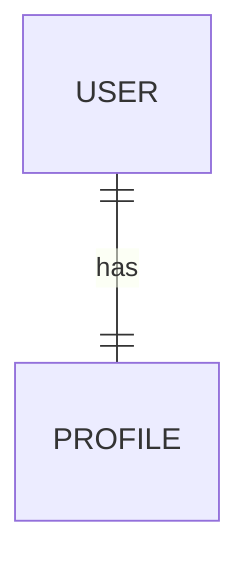

**One to many:**
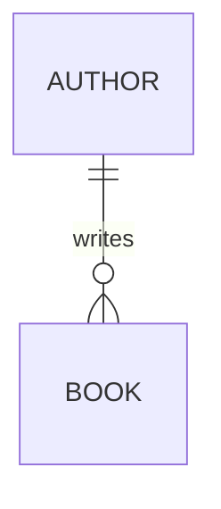

**Many to many:**
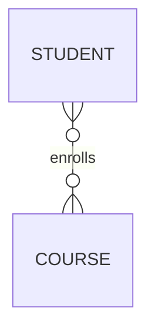

### Relationship Labels

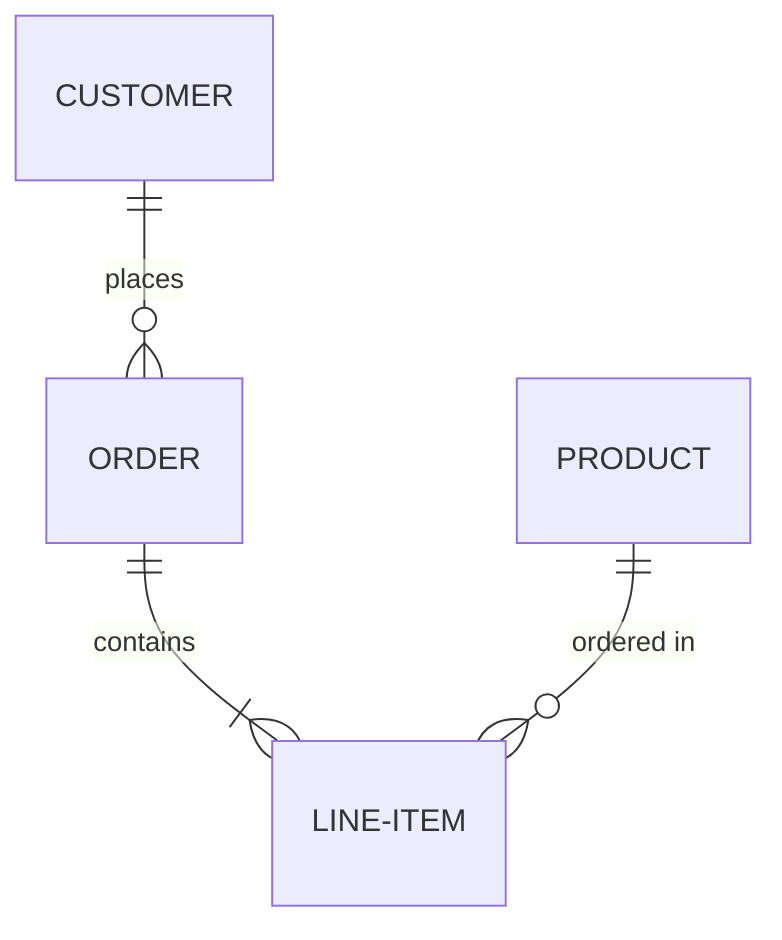

## State Diagram Syntax

### Basic Structure

State diagrams start with `stateDiagram-v2` and show state transitions:

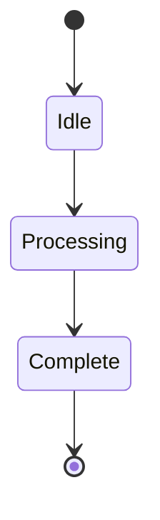

**Start state:** `[*]`
**End state:** `[*]`

### States with Description

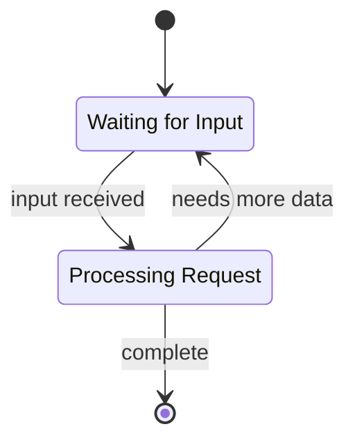

### Composite States

**States within states:**
```mermaid
stateDiagram-v2
    [*] --> Active

    state Active {
        [*] --> Running
        Running --> Paused
        Paused --> Running
        Running --> [*]
    }

    Active --> [*]
```

### Transitions with Conditions

```mermaid
stateDiagram-v2
    [*] --> Locked
    Locked --> Unlocked : enter correct PIN
    Locked --> AlarmState : 3 failed attempts
    Unlocked --> Locked : lock button
    AlarmState --> [*] : admin reset
```

### Choice (Conditional)

```mermaid
stateDiagram-v2
    state choice <<choice>>

    [*] --> Processing
    Processing --> choice
    choice --> Success : valid
    choice --> Error : invalid
    Error --> [*]
    Success --> [*]
```

### Concurrent States (Fork/Join)

```mermaid
stateDiagram-v2
    state fork <<fork>>
    state join <<join>>

    [*] --> fork
    fork --> Task1
    fork --> Task2

    Task1 --> join
    Task2 --> join
    join --> Complete
    Complete --> [*]
```

### Notes

```mermaid
stateDiagram-v2
    [*] --> Active

    note right of Active
        This is a note
        about the Active state
    end note

    Active --> [*]
```

## Complete Examples

### Example 1: E-commerce Class Diagram

```mermaid
classDiagram
    class Customer {
        +int id
        +String name
        +String email
        +List~Order~ orders
        +placeOrder()
        +viewOrders()
    }

    class Order {
        +int id
        +Date orderDate
        +String status
        +List~OrderItem~ items
        +calculateTotal()
        +processPayment()
    }

    class OrderItem {
        +int id
        +int quantity
        +decimal price
        +calculateSubtotal()
    }

    class Product {
        +int id
        +String name
        +decimal price
        +int stock
        +updateStock()
    }

    class Payment {
        <<interface>>
        +processPayment()*
        +refund()*
    }

    class CreditCardPayment {
        +String cardNumber
        +Date expiryDate
        +processPayment()
        +refund()
    }

    class PayPalPayment {
        +String email
        +processPayment()
        +refund()
    }

    Customer "1" --> "*" Order : places
    Order "1" *-- "*" OrderItem : contains
    OrderItem "*" --> "1" Product : references
    Order "1" --> "1" Payment : pays with
    Payment <|.. CreditCardPayment
    Payment <|.. PayPalPayment
```

### Example 2: Social Media Database Schema

```mermaid
erDiagram
    USER {
        int id PK
        string username
        string email
        string password_hash
        date created_at
    }

    POST {
        int id PK
        int user_id FK
        string content
        datetime created_at
        int likes_count
    }

    COMMENT {
        int id PK
        int post_id FK
        int user_id FK
        string content
        datetime created_at
    }

    FOLLOW {
        int follower_id FK
        int following_id FK
        date followed_at
    }

    LIKE {
        int user_id FK
        int post_id FK
        datetime liked_at
    }

    USER ||--o{ POST : creates
    USER ||--o{ COMMENT : writes
    POST ||--o{ COMMENT : has
    USER }o--o{ USER : follows
    USER }o--o{ POST : likes
```

### Example 3: Order Processing State Machine

```mermaid
stateDiagram-v2
    [*] --> Created

    Created --> PaymentPending : submit order
    PaymentPending --> PaymentProcessing : initiate payment

    state PaymentProcessing {
        [*] --> Authorizing
        Authorizing --> Capturing : authorized
        Capturing --> [*] : captured
    }

    PaymentProcessing --> Paid : payment successful
    PaymentProcessing --> PaymentFailed : payment failed

    PaymentFailed --> Cancelled : max retries
    PaymentFailed --> PaymentPending : retry

    Paid --> Fulfilling : start fulfillment

    state Fulfilling {
        [*] --> Picking
        Picking --> Packing : items picked
        Packing --> Shipping : package ready
        Shipping --> [*] : shipped
    }

    Fulfilling --> Shipped : fulfillment complete
    Shipped --> Delivered : delivery confirmed
    Delivered --> [*]

    Created --> Cancelled : user cancels
    PaymentPending --> Cancelled : timeout

    note right of Paid
        Payment confirmed
        Inventory reserved
    end note
```

### Example 4: Library Management System

```mermaid
classDiagram
    class Library {
        +String name
        +List~Book~ catalog
        +addBook()
        +removeBook()
        +searchBooks()
    }

    class Book {
        +String ISBN
        +String title
        +String author
        +int publicationYear
        +BookStatus status
    }

    class BookStatus {
        <<enumeration>>
        AVAILABLE
        CHECKED_OUT
        RESERVED
        LOST
    }

    class Member {
        +int id
        +String name
        +String email
        +Date memberSince
        +List~Loan~ loans
        +checkoutBook()
        +returnBook()
    }

    class Loan {
        +int id
        +Date checkoutDate
        +Date dueDate
        +Date returnDate
        +calculateFine()
    }

    class Librarian {
        +int employeeId
        +processCheckout()
        +processReturn()
        +manageInventory()
    }

    Library "1" *-- "*" Book : contains
    Library "1" o-- "*" Member : has
    Member "1" --> "*" Loan : borrows
    Loan "*" --> "1" Book : includes
    Book "1" --> "1" BookStatus : has
    Librarian "1" --> "*" Loan : manages
    Librarian --> Library : works at
```

### Example 5: Hospital Database Schema

```mermaid
erDiagram
    PATIENT {
        int id PK
        string name
        date date_of_birth
        string phone
        string address
    }

    DOCTOR {
        int id PK
        string name
        string specialization
        string phone
    }

    APPOINTMENT {
        int id PK
        int patient_id FK
        int doctor_id FK
        datetime appointment_datetime
        string status
        string reason
    }

    PRESCRIPTION {
        int id PK
        int appointment_id FK
        date prescribed_date
        string notes
    }

    MEDICATION {
        int id PK
        string name
        string dosage
        decimal price
    }

    PRESCRIPTION_ITEM {
        int prescription_id FK
        int medication_id FK
        string instructions
        int quantity
    }

    PATIENT ||--o{ APPOINTMENT : schedules
    DOCTOR ||--o{ APPOINTMENT : attends
    APPOINTMENT ||--o| PRESCRIPTION : generates
    PRESCRIPTION ||--|{ PRESCRIPTION_ITEM : contains
    MEDICATION ||--o{ PRESCRIPTION_ITEM : prescribed_in
```

### Example 6: User Authentication State Machine

```mermaid
stateDiagram-v2
    [*] --> LoggedOut

    LoggedOut --> EnteringCredentials : click login
    EnteringCredentials --> Authenticating : submit

    state Authenticating {
        [*] --> ValidatingCredentials
        ValidatingCredentials --> CheckingMFA : credentials valid
        ValidatingCredentials --> [*] : credentials invalid
        CheckingMFA --> [*] : MFA valid
        CheckingMFA --> [*] : MFA invalid
    }

    Authenticating --> LoggedIn : authentication successful
    Authenticating --> LoginFailed : authentication failed

    LoginFailed --> EnteringCredentials : retry
    LoginFailed --> AccountLocked : max attempts exceeded

    LoggedIn --> Active : user activity

    state Active {
        [*] --> Idle
        Idle --> Working : interaction
        Working --> Idle : timeout
    }

    Active --> SessionExpired : timeout
    SessionExpired --> LoggedOut : confirm

    LoggedIn --> LoggedOut : logout

    AccountLocked --> LoggedOut : admin reset

    note right of LoggedIn
        Session token issued
        User preferences loaded
    end note

    note left of AccountLocked
        Security measure
        Requires admin intervention
    end note
```

### Example 7: Vehicle Inheritance Hierarchy

```mermaid
classDiagram
    class Vehicle {
        <<abstract>>
        #String make
        #String model
        #int year
        #String color
        +start()*
        +stop()*
        +getInfo()
    }

    class Car {
        -int numDoors
        -String transmission
        +start()
        +stop()
        +openTrunk()
    }

    class Motorcycle {
        -String type
        -int engineCC
        +start()
        +stop()
        +wheelie()
    }

    class Truck {
        -int payloadCapacity
        -String bedSize
        +start()
        +stop()
        +lowerTailgate()
    }

    class ElectricCar {
        -int batteryCapacity
        -int range
        +charge()
    }

    class Engine {
        +String type
        +int horsepower
        +run()
    }

    class Battery {
        +int capacity
        +int currentCharge
        +charge()
        +discharge()
    }

    Vehicle <|-- Car
    Vehicle <|-- Motorcycle
    Vehicle <|-- Truck
    Car <|-- ElectricCar

    Vehicle o-- Engine : powered by
    ElectricCar *-- Battery : contains
```

## Tips and Best Practices

### Class Diagrams
1. **Use appropriate relationships**: Choose between composition, aggregation, and association based on ownership
2. **Visibility matters**: Use visibility modifiers to show encapsulation
3. **Abstract vs concrete**: Mark abstract classes and interfaces clearly
4. **Keep it focused**: Show relevant classes and relationships, not everything
5. **Cardinality is important**: Always specify multiplicity on relationships

### ER Diagrams
1. **Normalize properly**: Follow database normalization principles
2. **Name consistently**: Use singular or plural consistently for entity names
3. **Key constraints**: Always mark primary and foreign keys
4. **Relationship names**: Use verbs that make sense in both directions
5. **Many-to-many**: Consider showing junction tables explicitly

### State Diagrams
1. **Clear transitions**: Label all transitions with triggering events
2. **Complete paths**: Ensure all states have exit paths
3. **Use composite states**: Group related states for clarity
4. **Document guards**: Show conditions on transitions when relevant
5. **Start and end**: Always show initial and final states
