# Mermaid Syntax Quick Reference

## Common Styling Patterns

### Individual Element Styling

Apply styles directly to elements:

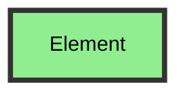

**Available style properties:**
- `fill` : Background color
- `stroke` : Border color
- `stroke-width` : Border width (in px)
- `color` : Text color
- `font-size` : Text size
- `font-weight` : bold, normal

### Class-Based Styling

Define reusable style classes:

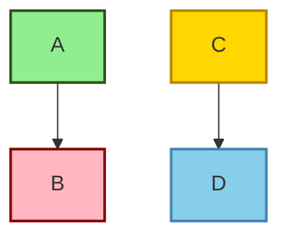

### Standard Color Palette

**Success/Positive:** `#90EE90` (light green), `#2ecc71` (green)
**Error/Negative:** `#FFB6C1` (light pink), `#e74c3c` (red)
**Warning:** `#FFD700` (gold), `#f39c12` (orange)
**Info:** `#87CEEB` (sky blue), `#3498db` (blue)
**Neutral:** `#D3D3D3` (light gray), `#95a5a6` (gray)

## Links and Tooltips

### Clickable Links

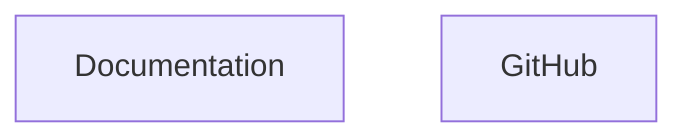

### Link with Tooltip

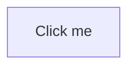

**Target options:**
- `_self` : Same tab (default)
- `_blank` : New tab
- `_parent` : Parent frame
- `_top` : Top frame

### JavaScript Callbacks

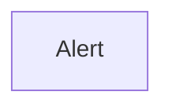

## Comments and Documentation

### Single-line Comments

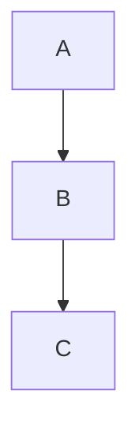

### Multi-line Documentation

```mermaid
flowchart TD
    %%{
      This is a multi-line comment
      Use for longer explanations
      Or documentation blocks
    }%%
    A --> B
```

### Inline Notes

Use notes to explain diagram sections (in sequence diagrams):

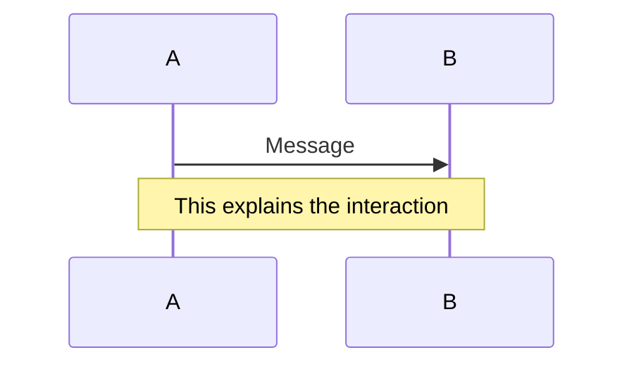

## Direction and Layout Control

### Flowchart Directions

- `TD` or `TB` : Top to Down
- `BT` : Bottom to Top
- `LR` : Left to Right
- `RL` : Right to Left

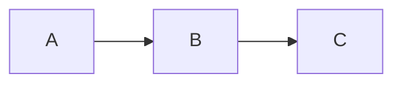

### Subgraph Direction

Override direction within subgraphs:

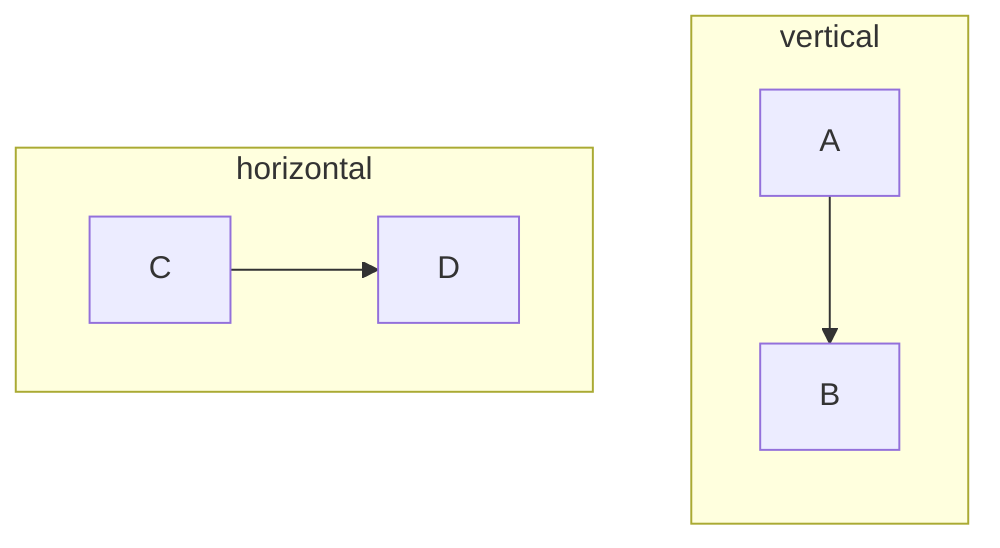

## Special Characters and Escaping

### Quotes in Labels

Use quotes for labels with special characters:

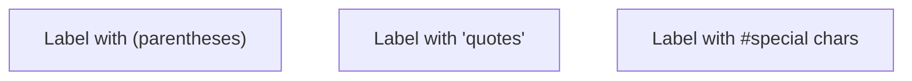

### HTML Entities

Use HTML entities for special symbols:

- `&nbsp;` : Non-breaking space
- `&lt;` : <
- `&gt;` : >
- `&amp;` : &
- `&quot;` : "

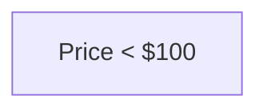

### Line Breaks in Labels

Use `<br/>` or `<br>` for line breaks:

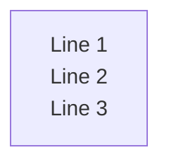

## Common Errors and Fixes

### Error: Invalid Node ID

**Problem:** `Node ID contains spaces`
```
Bad:  My Node --> Other Node
```
**Fix:** Use quotes or remove spaces
```
Good: MyNode --> OtherNode
Good: "My Node" --> "Other Node"
```

### Error: Missing Relationship Operator

**Problem:** `Incomplete arrow syntax`
```
Bad:  A->B  (flowchart needs -->)
```
**Fix:** Use correct operator for diagram type
```
Good: A --> B  (flowchart)
Good: A->>B   (sequence)
```

### Error: Unclosed Quotes

**Problem:** `String not terminated`
```
Bad:  A["Unclosed quote]
```
**Fix:** Match opening and closing quotes
```
Good: A["Properly closed"]
```

### Error: Invalid Character in ID

**Problem:** `Special characters in unquoted ID`
```
Bad:  node-with-dashes
```
**Fix:** Use underscores or quotes
```
Good: node_with_underscores
Good: "node-with-dashes"
```

### Error: Missing Diagram Type

**Problem:** `No diagram type declaration`
```
Bad:  A --> B  (at start of file)
```
**Fix:** Start with diagram type
```
Good: flowchart TD
      A --> B
```

## Performance Tips

### Large Diagrams

**For diagrams with > 20 nodes:**
1. Break into multiple smaller diagrams
2. Use subgraphs to organize
3. Avoid excessive styling
4. Limit number of relationships

### Rendering Issues

If diagram fails to render:
1. Validate syntax with validation script
2. Check for circular dependencies
3. Simplify complex relationships
4. Remove special characters from IDs

## Best Practices Summary

### General Guidelines

1. **Start simple**: Begin with basic structure, add styling later
2. **Use consistent naming**: Pick a convention and stick to it
3. **Comment complex sections**: Help future readers understand logic
4. **Validate early**: Use validation script during development
5. **Test rendering**: Check output in target environment

### Naming Conventions

**Good practices:**
- Use descriptive IDs: `UserLogin`, `PaymentProcessing`
- CamelCase or snake_case: `MyNode` or `my_node`
- Avoid generic names: Instead of `A`, use `Start` or `Input`

**Avoid:**
- Spaces in IDs without quotes
- Special characters: `@`, `#`, `$`, etc.
- Reserved keywords
- Very long IDs (> 50 chars)

### Label Guidelines

1. **Be concise**: Short labels improve readability
2. **Use action verbs**: "Process Payment", "Validate Input"
3. **Consistent capitalization**: Choose Title Case or Sentence case
4. **Break long text**: Use `<br/>` for multi-line labels

### Styling Consistency

1. **Use a color scheme**: Stick to 3-5 main colors
2. **Semantic colors**: Green = success, Red = error, Blue = info
3. **Apply classes**: Prefer classDef over individual styles
4. **Match design system**: Align with your brand colors

## Configuration Directives

### Theme

Set diagram theme:

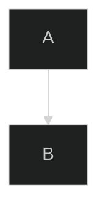

**Available themes:**
- `default` : Standard theme
- `dark` : Dark mode
- `forest` : Green theme
- `neutral` : Grayscale

### Custom Theme Variables

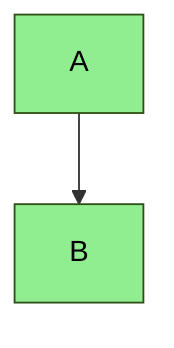

### Security Level

Control external links:

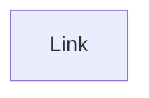

**Security levels:**
- `strict` : No external links
- `loose` : Allow external links
- `antiscript` : Sanitize scripts

## Keyboard Symbols Reference

Useful for keyboard shortcut documentation:

- `⌘` : Command (Mac)
- `⌃` : Control
- `⌥` : Option/Alt
- `⇧` : Shift
- `↵` : Enter/Return
- `⌫` : Delete/Backspace
- `⇥` : Tab
- `␣` : Space

Use in labels:

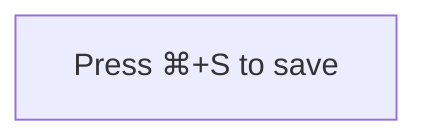

## Accessibility Considerations

1. **Color contrast**: Ensure text is readable on backgrounds
2. **Don't rely on color alone**: Use shapes, labels, and patterns
3. **Descriptive labels**: Make diagram understandable without visual context
4. **Alt text**: Provide textual description of diagram purpose
5. **Logical flow**: Arrange elements in reading order when possible

## Version Compatibility

**Modern syntax (v9.0+):**
- `flowchart` instead of `graph`
- `stateDiagram-v2` instead of `stateDiagram`
- Enhanced styling options

**Legacy syntax (< v9.0):**
- `graph` for flowcharts
- Limited styling support
- Different theme system

When writing diagrams, use modern syntax for better compatibility with recent mermaid versions.

## Quick Checklist

Before finalizing a diagram:

- [ ] Diagram type declared
- [ ] All nodes have unique IDs
- [ ] All relationships use correct syntax
- [ ] Labels are clear and concise
- [ ] Styling is consistent
- [ ] Quotes around labels with special characters
- [ ] Comments explain complex sections
- [ ] Validated with validation script
- [ ] Tested in target environment
- [ ] Follows color scheme/brand guidelines
