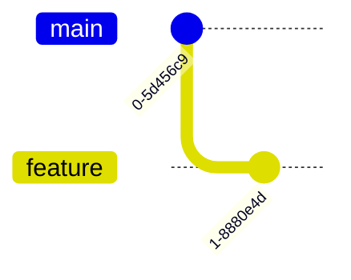
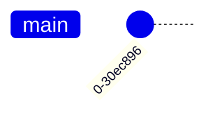
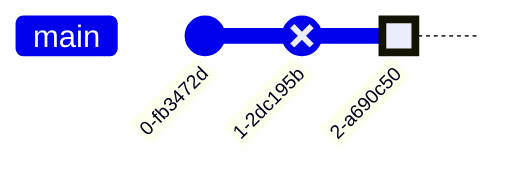

# Timeline Diagrams: Gantt, Timeline, and Git Graph

## Gantt Chart Syntax

### Basic Structure

Gantt charts start with `gantt` and show project schedules:


### Date Formats

**Common date formats:**
- `YYYY-MM-DD` : 2024-01-15
- `YYYY-MM-DD HH:mm` : 2024-01-15 09:00
- `DD-MM-YYYY` : 15-01-2024

Set format with `dateFormat` directive.

### Task Definition

**Basic task:** `Task name :id, start, duration`

**Duration formats:**
- `5d` : 5 days
- `3w` : 3 weeks
- `2h` : 2 hours
- `30m` : 30 minutes

**Start date options:**
- Absolute: `2024-01-01`
- Relative: `after taskId`
- Multiple dependencies: `after task1 task2`

### Task States

**Active task:**


**Done task:**


**Critical task:**


**Milestone:**


### Sections

Organize tasks into sections:


### Excluding Days

Exclude weekends or holidays:


**Exclude specific dates:**


## Timeline Syntax

### Basic Structure

Timelines show events chronologically:


### Multiple Events per Period


### Sections in Timeline


## Git Graph Syntax

### Basic Structure

Git graphs show version control branching:


### Branches

**Create branch:**


**Branch from specific branch:**


### Commits

**Simple commit:**


**Commit with ID:**


**Commit with tag:**


**Commit type:**


### Merging

**Merge branch:**


### Cherry-pick


## Complete Examples

### Example 1: Software Development Sprint

```mermaid
gantt
    title Sprint 24 - Jan 2024
    dateFormat YYYY-MM-DD
    excludes weekends

    section Planning
    Sprint planning :done, plan, 2024-01-02, 1d
    Story refinement :done, refine, 2024-01-03, 1d

    section Development
    User auth :crit, active, auth, after refine, 5d
    Dashboard UI :active, dash, after refine, 4d
    API endpoints :api, after auth, 3d
    Database migration :done, db, after refine, 2d

    section Testing
    Unit tests :test1, after auth, 2d
    Integration tests :test2, after api, 2d

    section Release
    Code review :review, after test2, 1d
    Deploy to staging :milestone, stage, after review, 0d
    QA testing :qa, after stage, 2d
    Production deploy :milestone, prod, after qa, 0d

    section Retrospective
    Sprint retro :retro, 2024-01-19, 2h
```

### Example 2: Product Development Timeline

```mermaid
timeline
    title SaaS Product Development Journey
    section Research
        Q1 2023 : Market Research
                : Customer Interviews
                : Competitive Analysis
    section Design
        Q2 2023 : Product Specification
                : UI/UX Design
                : Technical Architecture
    section Development
        Q3 2023 : MVP Development
                : Alpha Testing
        Q4 2023 : Beta Launch
                : User Feedback
    section Launch
        Q1 2024 : Public Launch
                : Marketing Campaign
                : 1000 Users
        Q2 2024 : Feature Expansion
                : Mobile App Launch
                : 5000 Users
```

### Example 3: Git Workflow with Feature Branches

```mermaid
gitGraph
    commit id: "Initial commit"
    commit id: "Setup project structure"

    branch develop
    checkout develop
    commit id: "Add configuration"

    branch feature/auth
    checkout feature/auth
    commit id: "Add login page"
    commit id: "Implement JWT"

    checkout develop
    branch feature/dashboard
    checkout feature/dashboard
    commit id: "Dashboard layout"
    commit id: "Add widgets"

    checkout develop
    merge feature/auth
    commit id: "Update dependencies"

    merge feature/dashboard

    checkout main
    merge develop tag: "v1.0.0"

    checkout develop
    branch feature/notifications
    checkout feature/notifications
    commit id: "Add notification service"

    checkout main
    commit id: "Hotfix: security patch"

    checkout develop
    merge main
    merge feature/notifications

    checkout main
    merge develop tag: "v1.1.0"
```

### Example 4: Construction Project Schedule

```mermaid
gantt
    title Office Building Construction
    dateFormat YYYY-MM-DD

    section Planning
    Site survey :done, survey, 2024-01-01, 14d
    Permits :done, permits, after survey, 21d
    Final design :done, design, after survey, 28d

    section Foundation
    Excavation :crit, done, excav, after permits, 10d
    Foundation pour :crit, done, found, after excav, 7d
    Curing :done, cure, after found, 14d

    section Structure
    Steel framework :crit, active, steel, after cure, 35d
    Concrete floors :active, floors, after steel, 28d
    Roof structure :roof, after floors, 21d

    section Exterior
    Windows installation :windows, after steel, 14d
    Facade :facade, after windows, 21d

    section Interior
    Electrical :elect, after floors, 28d
    Plumbing :plumb, after floors, 28d
    HVAC :hvac, after floors, 35d
    Drywall :drywall, after elect plumb, 21d
    Interior finish :finish, after drywall, 28d

    section Completion
    Inspection :milestone, inspect, after finish, 0d
    Final walkthrough :walk, after inspect, 3d
    Handover :milestone, done, after walk, 0d
```

### Example 5: Company History Timeline

```mermaid
timeline
    title Tech Startup Evolution
    section Founding
        2015 : Founded in garage
             : 3 co-founders
             : First prototype
    section Seed Stage
        2016 : Seed funding $500K
             : First 5 employees
             : Beta launch
        2017 : 100 paying customers
             : Revenue $50K/month
    section Growth
        2018 : Series A $5M
             : Expanded to 30 employees
             : Product v2.0 launch
        2019 : Series B $20M
             : International expansion
             : 10,000 customers
        2020 : Acquired startup XYZ
             : 100 employees
             : Revenue $10M/year
    section Scale
        2021 : Series C $50M
             : IPO planning begins
             : 50,000 customers
        2022 : IPO on NASDAQ
             : Market cap $500M
             : 300 employees
        2023 : Expansion to APAC
             : Revenue $100M/year
             : 100,000 customers
```

### Example 6: Release Management Git Flow

```mermaid
gitGraph
    commit id: "v1.0.0"

    branch develop
    checkout develop

    branch feature/user-profile
    checkout feature/user-profile
    commit id: "Profile UI"
    commit id: "Profile API"

    checkout develop
    branch feature/search
    checkout feature/search
    commit id: "Search implementation"

    checkout develop
    merge feature/user-profile

    checkout feature/search
    commit id: "Search optimization"

    checkout develop
    merge feature/search

    branch release/1.1
    checkout release/1.1
    commit id: "Update version to 1.1"
    commit id: "Update changelog"

    checkout main
    merge release/1.1 tag: "v1.1.0"

    checkout develop
    merge release/1.1

    checkout main
    branch hotfix/security
    checkout hotfix/security
    commit id: "Security patch" type: HIGHLIGHT

    checkout main
    merge hotfix/security tag: "v1.1.1"

    checkout develop
    merge hotfix/security

    branch feature/analytics
    checkout feature/analytics
    commit id: "Add analytics"

    checkout develop
    merge feature/analytics

    checkout main
    merge develop tag: "v1.2.0"
```

## Tips and Best Practices

### Gantt Charts
1. **Set realistic durations**: Account for dependencies and resource availability
2. **Use milestones**: Mark important deliverables and decision points
3. **Show critical path**: Mark critical tasks that affect project completion
4. **Exclude non-working days**: Use `excludes` for accurate scheduling
5. **Group related tasks**: Use sections to organize work streams
6. **Dependencies matter**: Use `after` to show task dependencies
7. **Keep it readable**: Aim for < 20 tasks for clarity

### Timelines
1. **Consistent periods**: Use uniform time periods (quarters, years, etc.)
2. **Meaningful events**: Include significant milestones only
3. **Chronological order**: Always present events in time order
4. **Use sections**: Group related events for better organization
5. **Balance detail**: Too many events reduces readability

### Git Graphs
1. **Follow your workflow**: Match your actual git workflow (Git Flow, GitHub Flow, etc.)
2. **Use meaningful IDs**: Commit messages should be descriptive
3. **Tag releases**: Mark version releases with tags
4. **Show main branches**: Always show main/master and develop branches
5. **Limit complexity**: Show 10-15 commits max for readability
6. **Merge regularly**: Show integration points between branches
7. **Highlight important commits**: Use commit types to emphasize key changes
